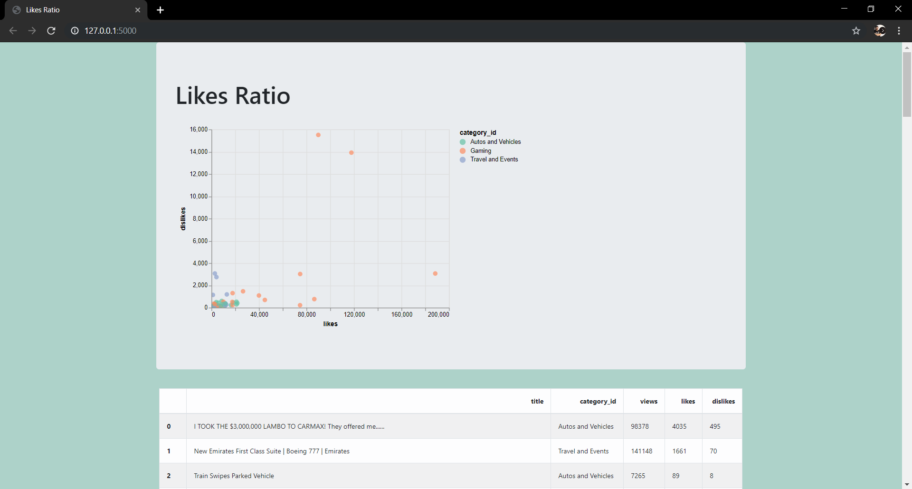

# Likesratio

## Description

This webapp is a simplified version of Samuel Chan's [Pricemate](https://github.com/onlyphantom/pricemate).

Likesratio created to help new developers to make a simple reporting webapps from csv or sqlite source, while Sam's pricemate more focused to web scrapping. This webapp use youtube trending videos data from 2016.

The web app shows a simple interactive visualization with tooltips of the likes and dislikes of the YouTube video, which color coded by the video category.

## Dependencies

- Pandas
- Flask
- Altair
- Education-oriented

## Education-oriented

- The web app is implemented with just the bare bones, sufficient to demonstrate an idea and simple enough to keep it extensible for new developers
- Accompanied with the commend that created to explaining the function of the codes.
- Feel free to email me or mentor@algorit.ma if you need some help or further question.
